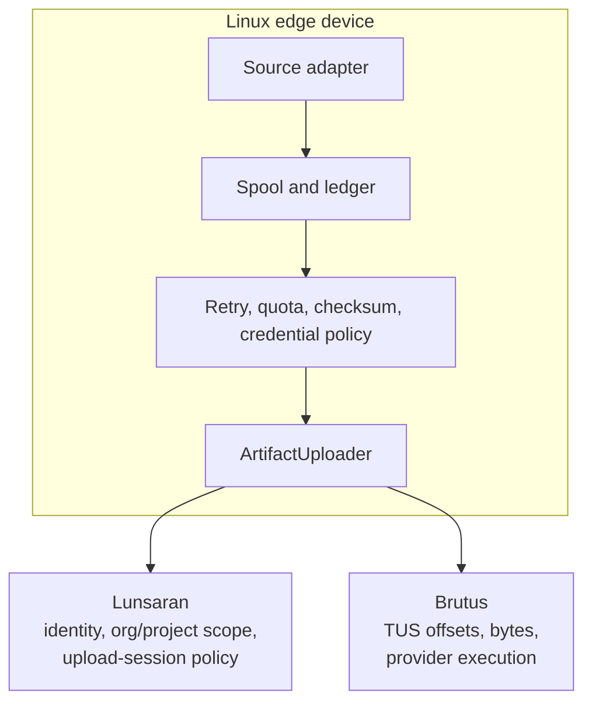
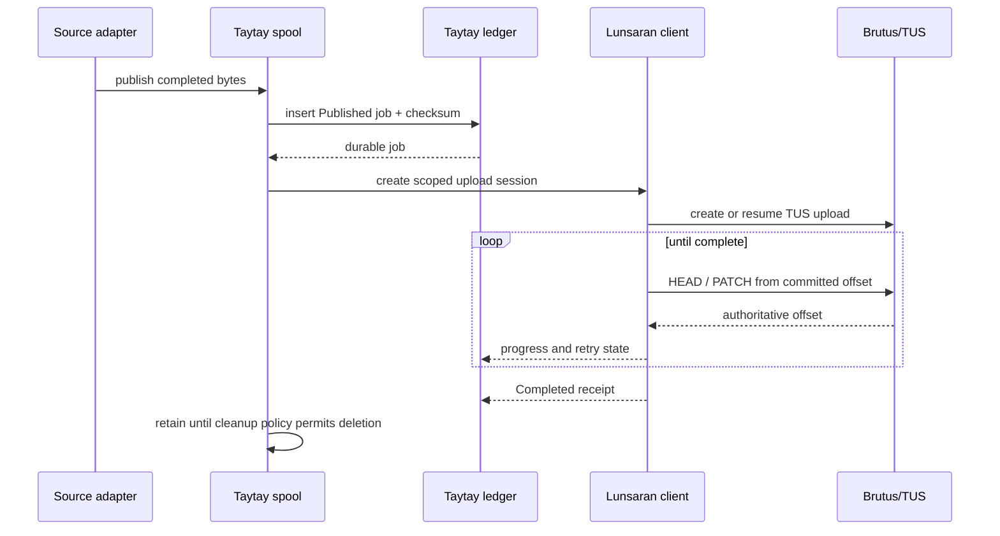

# Architecture

Taytay separates source acquisition, local durability, and remote transfer.
This lets an integrator replace a camera or transport without changing the
durability contract.

## Ownership boundaries

Taytay owns source credentials and local state. It must never receive or
persist customer storage-provider credentials. Lunsaran owns the authorization
decision for a new upload session. Brutus owns the byte-level TUS behavior.

## Upload lifecycle

## Consumer responsibilities

Your application is responsible for:

- Detecting when source output is complete before publishing it.
- Assigning stable artifact and source identifiers.
- Keeping source credentials local and redacting source metadata in logs.
- Supplying a persistent spool path with enough quota for offline operation.
- Running the upload worker and handling retryable versus terminal errors.
- Provisioning Lunsaran scope and rotating device credentials.

Taytay does not make an incomplete file complete, infer tenant authorization,
or provide a hosted administration UI.
