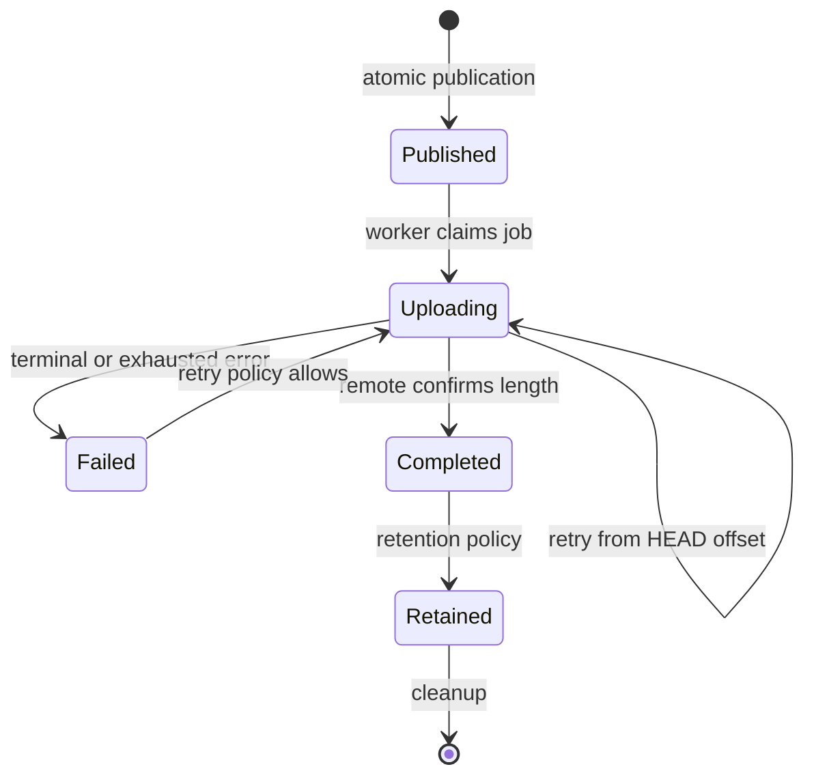

# Durability and recovery

Taytay treats a published artifact as a durable job until the remote service
confirms completion. Offline operation is therefore a storage and scheduling
problem, not a reason to discard source output.

## Publication guarantees

`Spool::publish`:

1. Checks the quota before writing.
2. Writes to a `.part` file.
3. Calls `sync_all` and atomically renames the file.
4. Computes SHA-256 and records it with the artifact.
5. Inserts a `Published` job into the ledger.

If ledger insertion fails, the final artifact is removed. If the process stops
before publication, the temporary file is not treated as a completed artifact.

## Restart behavior

The ledger is reopened from the spool directory. Pending jobs retain their
artifact path, attempt count, server upload identity, and offset. The remote
TUS offset is authoritative when resuming; Taytay validates that the server
does not move backwards, skip bytes, or exceed the declared artifact length.

## Backpressure and cleanup

Use a quota below the actual filesystem capacity. When the quota is exhausted,
publication fails with a quota error; Taytay does not delete pending work to
make room. Cleanup should run only after completion and an explicit retention
policy.

Cancellation stops new work at the scheduler boundary and can cancel an
in-flight upload through the `lunsaran-entregar` 0.1.1 cancellation token.
The library also exposes `Spool::pause` and `Spool::resume`: paused jobs are
persisted in the ledger, excluded from pending work, and returned to
`Published` when resumed. Cancellation is appropriate for stopping an
in-flight upload; the application can then pause or retry the durable job.

## What to test in your integration

- Restart after publication but before upload.
- Restart after a partial TUS PATCH.
- Duplicate source publication with the same artifact ID.
- Checksum mismatch after local file mutation.
- Quota exhaustion and recovery after retention cleanup.
- Credential expiry while jobs remain queued.
- Source disconnect while the worker is retrying.
