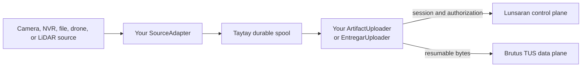

# Taytay

Taytay is a Rust edge bridge for applications that capture or receive media on
Linux and need to deliver it to Lunsaran reliably. It turns source output into
durable, checksummed, resumable upload jobs.

Taytay is intended for:

- OEMs embedding Lunsaran uploads into cameras, gateways, and field systems.
- Rust integrators building source adapters for CCTV, NVR, USB cameras, drones,
  LiDAR, or local file exports.
- Platform teams operating an edge worker that must survive offline periods,
  restarts, and transient upload failures.

It is a library and reference service boundary, not a hosted camera platform.
The public crate owns edge durability and transfer orchestration. Lunsaran owns
identity, organization/project authorization, and upload-session policy. Brutus
owns the TUS data plane and provider execution.

## The name

*Taytay* is a Hiligaynon word for “bridge”. The name reflects the crate’s role
connecting edge sources and durable local state to the Lunsaran platform.

## What the crate gives you

- Typed `Artifact`, `UploadJob`, source, uploader, and error contracts.
- Atomic publication into a quota-bounded local spool.
- SHA-256 verification before transfer and checksum-bound resume state.
- Restart recovery, bounded scheduling, retry policy, and cancellation seams.
- A public `lunsaran-entregar` integration behind Taytay’s uploader port.
- Source-policy primitives for filesystem/NVR, V4L2, RTSP, ONVIF, and field
  metadata without coupling the core queue to a vendor SDK.

## Start here

- [Quick start](quickstart.md) — add the crate, publish an artifact, and run
  the reference diagnostics.
- [Architecture](architecture.md) — understand ownership and the execution
  path.
- [Rust crate guide](crate-guide.md) — choose the interfaces to implement.
- [Durability and recovery](durability.md) — understand the guarantees around
  local files and restart behavior.
- [Uploads and TUS](uploads.md) — integrate Lunsaran sessions and resumable
  transfer.
- [Operations](operations.md) — configure and run the reference service.

The private architecture and planning harness is intentionally kept outside
this public documentation site. This site describes the stable consumer-facing
boundary.
