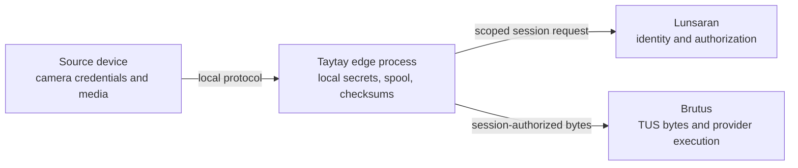

# Security

Taytay runs at the edge, where source credentials and media are present. The
security model is therefore intentionally narrow: keep source secrets local,
send only the scoped upload information required by Lunsaran, and avoid making
the edge responsible for platform identity policy.

## Trust boundaries

Taytay never receives or persists customer storage-provider credentials. It
does hold source credentials and a scoped Lunsaran device/workload credential
locally, so file permissions and service-account isolation matter.

## Secret handling

- Store token files with no group/other permissions.
- Keep secrets out of artifact metadata, filenames, metrics, and logs.
- Validate base URLs before making requests.
- Treat signed URLs and authorization headers as sensitive.
- Use opaque source and artifact identifiers in operational output.
- Redact errors before forwarding them to logs or telemetry.

`config::Secret` intentionally has a redacted `Debug` representation. This is
not a substitute for filesystem permissions or a host secret-management policy.

## Authorization and lifecycle

Device credentials move through enrollment, activation, rotation, revocation,
and expiry. Only active, unexpired credentials may create a new upload session.
Queued artifacts remain local when authorization fails; an authorization error
must not cause data loss.

## Consumer checklist

- Run the process as an unprivileged account.
- Use a dedicated spool directory with a deliberate quota.
- Restrict configuration and token-file permissions.
- Protect diagnostics and metrics at the network boundary.
- Test rotation and revocation before field deployment.
- Review every adapter for credential and metadata leakage.
