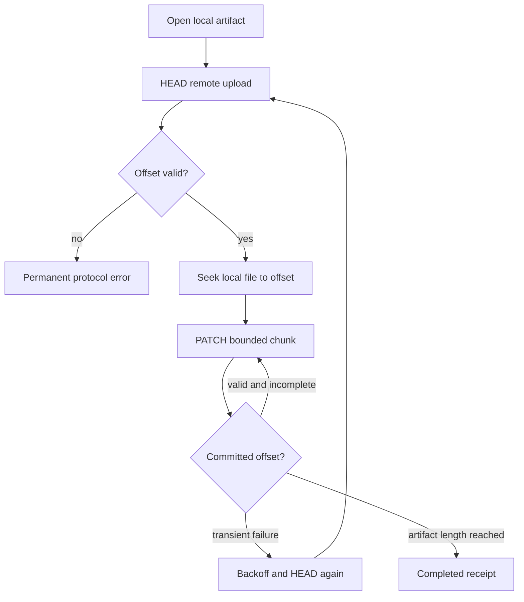

# Uploads and TUS

Taytay's transfer boundary has two layers:

1. A Lunsaran client creates an organization/project-scoped upload session.
2. A TUS client writes the artifact bytes using the server's committed offset.

The public `EntregarUploader` combines these layers through the published
`lunsaran-entregar` client. Custom integrators can implement the same behavior
behind `ArtifactUploader`.

## Session invariants

An upload session must be validated before bytes are sent:

- Organization and project scope match the job's intended destination.
- The upload URL is present and uses an approved HTTP(S) origin.
- The chunk size is positive.
- The session has not expired.
- The credential is active and usable for a new session.

Taytay uses the stable artifact ID as the idempotency key. A retry must refer
to the same logical artifact rather than creating a second session.

## Offset recovery

After an interruption, issue `HEAD`, seek the local file to the returned
offset, and continue with `PATCH`. Never assume that the number of bytes sent
by a failed request equals the number committed by Brutus.

## Error handling

Treat HTTP 401/403 as authorization failures that preserve the local job but
stop new session creation. Treat transport failures, 408, 429, and server
errors as retryable according to bounded backoff. Treat invalid session scope,
invalid offsets, malformed responses, and local file failures as terminal until
an operator or application fixes the cause.

Do not log bearer tokens, signed upload URLs, response bodies that may contain
secrets, or media payloads. Record a redacted error class and the durable job
ID instead.

## Checksum boundary

Taytay verifies the local SHA-256 before transfer and propagates it through the
published `lunsaran-entregar` 0.1.1 session request. The Lunsaran service must
still enforce and report the checksum according to its deployed upload-session
contract; verify that behavior in the hosted acceptance environment.
